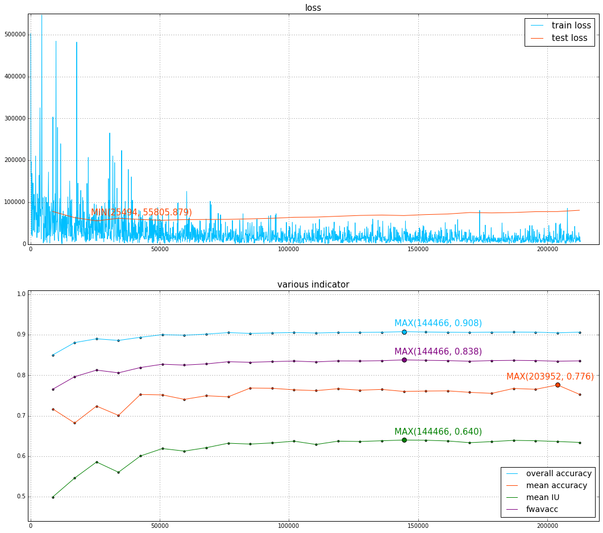
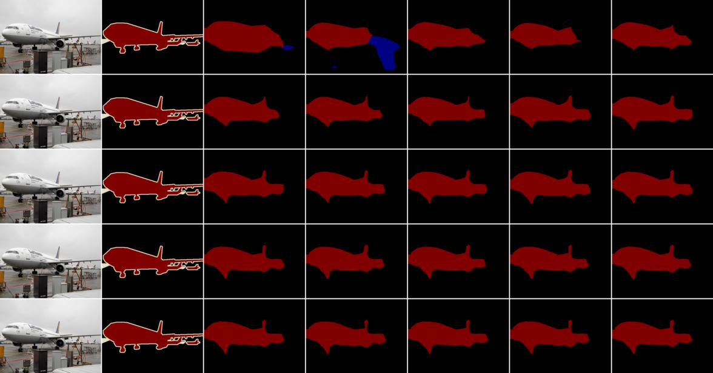
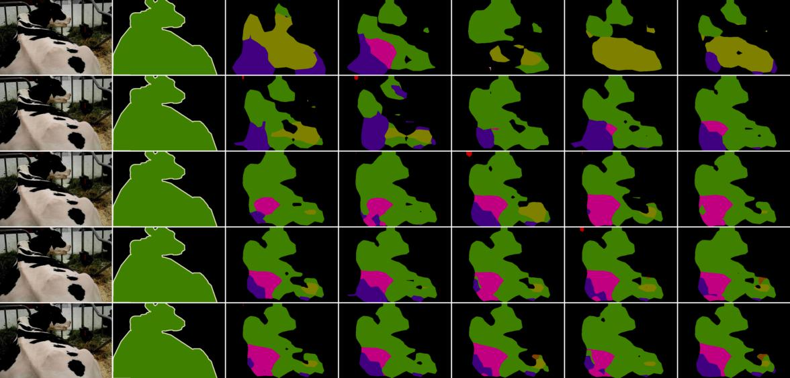
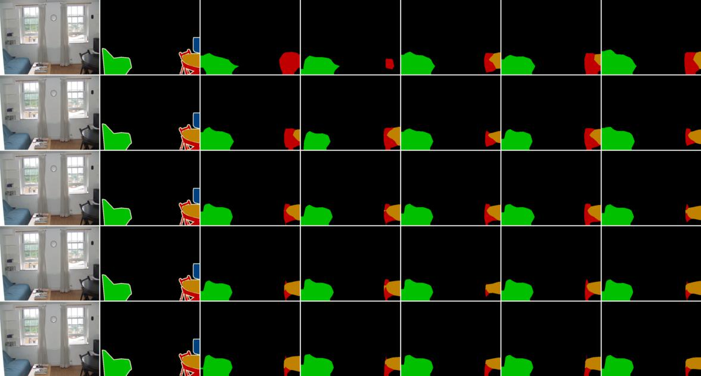
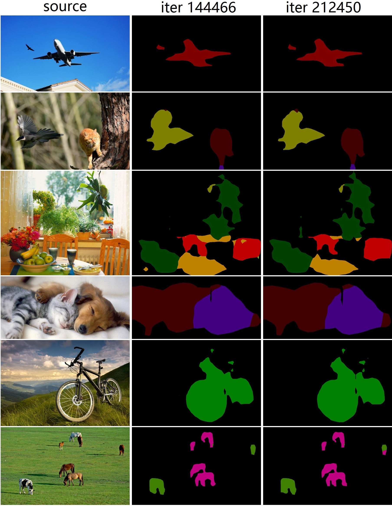

## fcn_voc_32s
Source code to implement [FCN](https://arxiv.org/abs/1605.06211) voc-fcn32s, reference to [fcn.berkeleyvision.org](https://github.com/shelhamer/fcn.berkeleyvision.org). <br>
Detailed introduction: http://blog.csdn.net/binlearning/article/details/72854136 .<br>
<br>
The project consists of three steps: <br>
### 1.transfer and initialization
```
# python trans_and_init.py VGG_ILSVRC_16_layers.prototxt VGG_ILSVRC_16_layers.caffemodel voc_fcn32s_deploy.prototxt voc_fcn32s_trans_init.caffemodel
```
NOTE:<br>
Download trained VGG model from http://www.robots.ox.ac.uk/~vgg/research/very_deep/

### 2.training
(1) Using the command line mode
```
# /path-to-caffe/build/tools/caffe train -solver ./model/solver_cmdline.prototxt -weights ./model/voc_fcn32s_trans_init.caffemodel -gpu 0
```
(2) Using the Python program
```
# python solve.py
```
NOTE:<br>
a. You have to build Caffe with WITH_PYTHON_LAYER option.<br>
b. When using the command line mode, you have to copy voc_layers.py to /path-to-caffe/python, otherwise you will get an error "ImportError: No module named voc_layers".




### 3.inference
```
# python infer.py ./test_images/src_01.jpg ./test_images/infer_01.jpg
```


### Contact Info
If you have any problem on this project, please contact me by sending email to binlearning@163.com.
